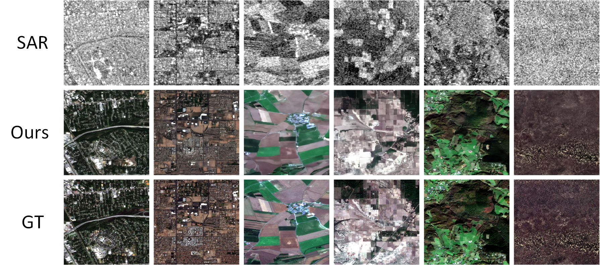
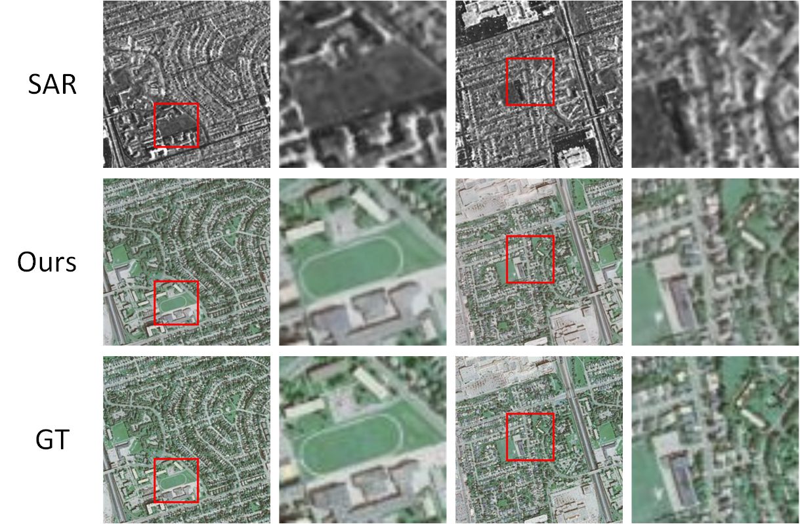

# Residual-Decomposition-Generation-Strategy-for-S2O
The official implementation of Conditional Diffusion Model with Residual Decomposition Generation Strategy for SAR to Optical Image Translation

**Notice:**  
This repository currently contains partial code and experimental result figures to demonstrate key components of our work. The complete source code will be fully released upon acceptance of our manuscript, which is currently under review/submitted.

We appreciate your understanding and interest in our research.

## Abstract
Synthetic aperture radar (SAR)–to–optical image translation aims to recover visually interpretable optical images from SAR images acquired under all-weather and all-day conditions, yet remains challenging due to the substantial modality gap between SAR and optical image. Existing learning-based approaches exhibit complementary limitations: GAN-based methods tend to preserve global structure but often produce over-smoothed textures and suffer from training instability, while diffusion-based models excel at detail synthesis but struggle when directly modeling the full SAR-to-optical mapping, leading to structural distortions and inefficient optimization. To address these issues, this paper proposes a two-stage SAR-to-optical translation framework based on residual decomposition and diffusion-based refinement. In the first stage, ......

## Experimental Results
The following figures demonstrate main experimental results

- Results on SEN1-2 Dataset

- Results on SAR2Opt Dataset

The complete training and inference code, along with full experimental settings, will be released upon paper acceptance.