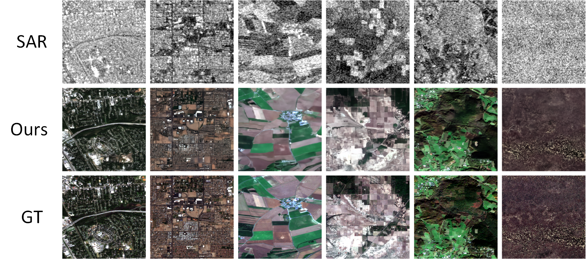
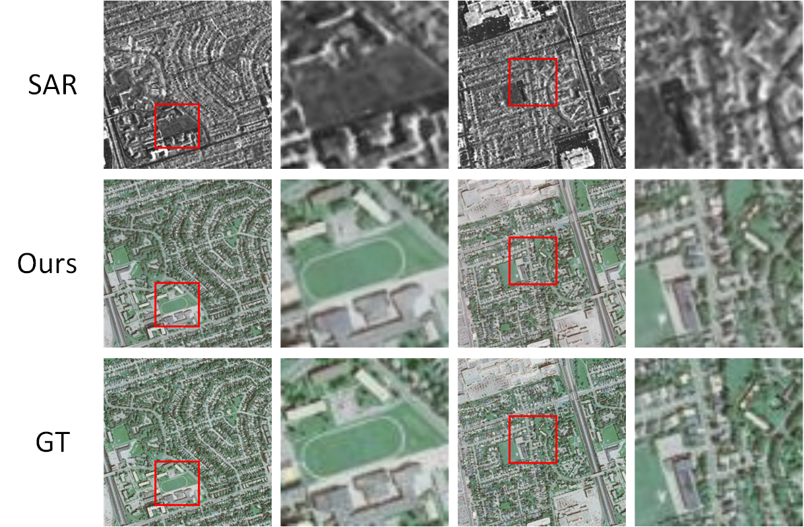

# Residual-Decomposition-Generation-Strategy-for-S2O

The official implementation of Conditional Diffusion Model with Residual Decomposition Generation Strategy for SAR to Optical Image Translation

## Abstract

Synthetic aperture radar (SAR)-to-optical image translation aims to recover visually interpretable optical
images from SAR images acquired under all-weather and all-day conditions, yet remains challenging due
to the substantial modality gap between SAR and optical image. Existing learning-based approaches exhibit
complementary limitations: GAN-based methods tend to preserve global structure but often produce over smoothed textures and suffer from training instability, while diffusion-based models excel at detail synthesis
but struggle when directly modeling the full SAR-to-optical mapping, leading to structural distortions and
inefficient optimization. To address these problems, this paper proposes a two-stage SAR-to-optical translation
framework based on conditional residual diffusion refinement strategy (CRDRS). In the first stage, a conditional
GAN generates a coarse pseudo-optical image that captures the overall scene structure, providing a stable and
geometry-consistent prior. In the second stage, CRDRS is used to predict the residual between the pseudo optical image and the real optical target, rather than directly synthesizing the optical image. CRDRS can
simplify the learning objective by concentrating the diffusion process on high-frequency details and localized
discrepancies. Furthermore, a heuristic theoretical analysis is provided to show that CRDRS can reduce target
variance and lower intrinsic denoising error compared with direct optical generation, leading to a better
conditioned optimization problem. Experiments on two representative SAR-optical datasets demonstrate that
the proposed method consistently improves both pixel-level and perceptual performance, while exhibiting
enhanced robustness to degraded coarse guidance.

## Experimental Results

The following figures demonstrate main experimental results

- Results on SEN1-2 Dataset



- Results on SAR2Opt Dataset



The complete training and inference code, along with full experimental settings, will be released upon paper acceptance.

## Sync Environment

This project is based on uv, so please install uv first and then run the following command to sync the environment.

1. Clone the repository and navigate to the project directory.

   ```bash
   git clone https://github.com/Mizar29/Residual-Decomposition-Generation-Strategy-for-S2O.git && cd Residual-Decomposition-Generation-Strategy-for-S2O
   ```

2. Sync the environment.

   ```bash
   uv sync
   ```

## Acknowledgments

This repository is built upon:

- [Pix2Pix](https://github.com/yuuIind/SAR2Optical.git)

- [SAR2Opt-Heterogeneous-Dataset](https://github.com/MarsZhaoYT/SAR2Opt-Heterogeneous-Dataset.git)

- [denoising-diffusion-pytorch](https://github.com/lucidrains/denoising-diffusion-pytorch.git)

We heavy rely on their excellent implementation of Diffusion and Generative Adversarial Networks.

In addition, We would like to express our gratitude to the authors of

- [Conditional-Diffusion-for-SAR-to-Optical-Image-Translation](https://github.com/Coordi777/Conditional-Diffusion-for-SAR-to-Optical-Image-Translation.git)

- [ACD_S2ODPM](https://github.com/Coordi777/ACD_S2ODPM.git)

- [ControlNet](https://github.com/lllyasviel/ControlNet.git)

for their groundbreaking work and for making their code publicly available, which greatly facilitated our research.
